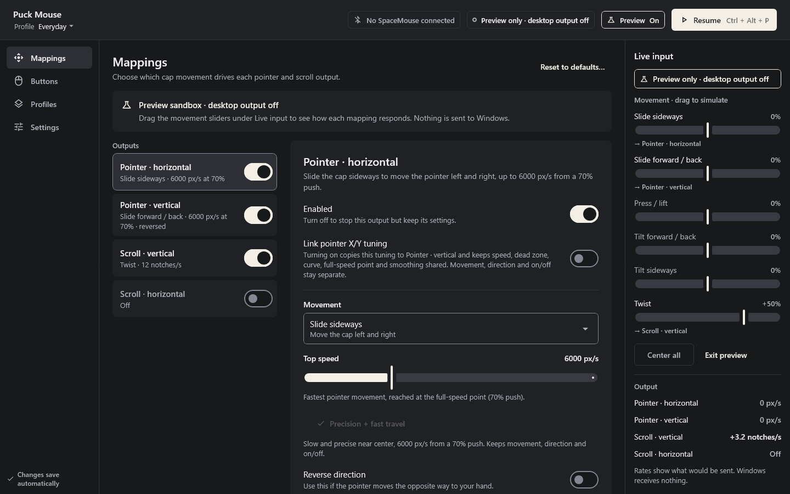

# Puck Mouse

A Windows desktop utility that turns a SpaceMouse into an everyday pointing
and scrolling device. Written in Kotlin/JVM with Compose Desktop; motion is
processed by [Puck](https://github.com/clankagent/puck)'s Rust DLL.



- Map each of the six cap movements to horizontal/vertical pointer or scroll output.
- Twist to scroll by default; choose tilt, slide or press/lift instead.
- Adjust speed, direction, dead zone, response curve and smoothing independently.
- Link horizontal/vertical tuning for the pointer or scrolling, keeping movement
  assignments, direction and on/off separate.
- Shape the response with an exponent from 0.5 to 12 and a full-speed point.
  Pointer speed can reach 20,000 px/s. New defaults combine a stronger curve with
  6,000 px/s top speed reached at 70% push, for precision near center and fast travel.
- Assign the two device buttons to mouse buttons, Back/Forward, pause or a held clutch.
- Keep named profiles; duplicate, rename, reset, import and export them.
- Pause from the main window, a configurable global shortcut or the system tray.
- Try settings in a preview sandbox that never sends desktop input.

## Requirements and tested scope

Windows x64 and a SpaceMouse Wireless with the measured Bluetooth report profile
`256f:c63a` (Generic Desktop / Multi-axis Controller). Other product IDs and
USB/split report layouts are not enabled. Unknown layouts are ignored.
The [Microsoft x64 Visual C++ v14 runtime](https://learn.microsoft.com/en-us/cpp/windows/latest-supported-vc-redist)
must be installed for the bundled Puck DLL. A Java runtime is included in packaged
distributions; users do not need a separate Java installation.

This is an early preview. DLL integration, synthetic reports, pause/rearm,
settings, native registration and UI behavior have automated checks. The desktop
host has not yet been physically validated with a SpaceMouse. Device-specific
signs, comfort, latency and coexistence with the 3Dconnexion driver need hardware
testing. Puck's report profile was measured separately; that does not constitute
physical testing of this app.

## Getting started

Download the MSI or EXE installer from [Releases](https://github.com/clankagent/puck-mouse/releases).
Both contain the same app and bundled Java runtime. Preview installers are
unsigned, so Windows may show an unknown-publisher warning. Published downloads
include SHA-256 checksums.

Launch the app, choose or edit a profile, and connect the supported device.
The app always starts paused. Resume from the header or press **Ctrl + Alt + P**
(the default shortcut), then release the cap to neutral to arm desktop output.
Pausing discards accumulated movement and releases held mouse buttons. Resuming,
device changes and mapping changes require a fresh neutral report; silence is
never interpreted as a neutral report.

Button 1 defaults to Left click; Button 2 defaults to Toggle pause. A click
assignment behaves like a mouse button: holding it allows dragging. Pause while
held acts as a clutch and does not override a separate manual pause.

**Link pointer X/Y tuning** and **Link scroll X/Y tuning** share speed, dead zone,
curve, full-speed point and smoothing within that pair. Enabling a link copies
the output you're editing to its partner. Unlinking keeps the values and lets
you edit them independently.

In **Fine tuning**, a larger exponent reduces speed near center and through the
middle of the cap's travel. **Full speed at** determines how far to push before
reaching top speed; lowering it makes fast travel available with less force.
The chart and sample speeds show both effects together. Existing profiles keep
their tuning on upgrade; choose **Precision + fast travel** to apply the new
pointer defaults while retaining movement assignments and direction.

Choose **Try without device** to inspect mappings in preview mode. Its sliders
are simulated cap deflections; they cannot move the system cursor or scroll other
applications. Leaving preview returns to paused mode.

The app runs unelevated. Windows restricts injected input into elevated apps;
Puck Mouse reports an output failure and pauses when injection is blocked. It
does not modify Windows pointer settings or disable the 3Dconnexion driver.
Closing the window keeps the app in the tray by default; choose Quit to release
input registrations and exit. Automatic startup is not registered.

Settings stay locally in `%APPDATA%/PuckMouse/settings.json`. Import/export files
contain profiles and preferences, with no recordings or device paths. The app has
no telemetry, account requirement, network service or cloud synchronization.

## Build

Use JDK 21 and the checked-in Gradle wrapper:

```powershell
./gradlew.bat test
./gradlew.bat run
./gradlew.bat createDistributable packageMsi packageExe
```

Kotlin 2.4.20, Compose 1.12.1, Gradle 9.7.0 and JNA 5.19.1 are pinned.
The released Puck DLL is bundled with its license and a pinned SHA-256 checksum.
Puck handles stay on one input thread; the UI owns no native engine handles.
The package is Windows x64 only. Development Hot Reload and its stdio MCP are
available through `hotRunAsync` / `hotMcpServer`; they are excluded from packaged
runtime dependencies. Tests and `--qa` preview mode do not inject desktop input.

MIT License. SpaceMouse is a trademark of 3Dconnexion; this project is independent.
